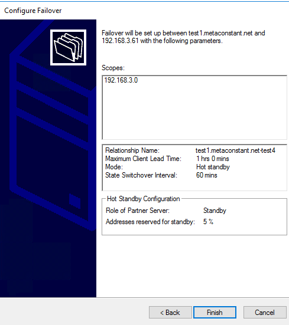

# Scenario 1: Both Test1 and Test2 DHCP servers are dead, rebuild Test3 and Test4, restore from backup and export, rebuild the hot standby relationship

DC109.metaconstant.net 192.168.3.109 Active Directory, DNS

Test1.metaconstant.net 192.168.3.108 DHCP server

Test2.metaconstant.net 192.168.3.114 DHCP server

Test3.metaconstant.net 192.168.3.59 DHCP server

Test4.metaconstant.net 192.168.3.61 DHCP server

1.  VM deploy, join domain, setup DHCP for Test1 and Test2, authorize,
    setup scope and failover.

2.  From Test 1, Open Powershell for backup, export.

new-item -type Directory -path C:\exportdir\Test1backup -force

Export-DhcpServer -ComputerName "Test2.metaconstant.net" -File
"C:\exportdir\Test1_dhcpexport_All.xml" -Leases -force

Export-DhcpServer -ComputerName "Test1.metaconstant.net" -File
"C:\exportdir\Test1_dhcpexport_Config.xml" -force

Backup-DhcpServer -ComputerName "Test1.metaconstant.net" -Path
“C:\exportdir\Test1backup"

3.  From Test 2, Open Powershell for backup, export.

new-item -type Directory -path C:\exportdir\Test2backup -force

Export-DhcpServer -ComputerName "Test2.metaconstant.net" -File
"C:\exportdir\Test2_dhcpexport_All.xml" -Leases -force

Export-DhcpServer -ComputerName "Test2.metaconstant.net" -File
"C:\exportdir\Test2_dhcpexport_Config.xml" -force

Backup-DhcpServer -ComputerName "Test2.metaconstant.net" -Path
"C:\exportdir\Test2backup"

4.  Copy the file to a temp place (DC109.metaconstant.com), and power
    off Test 1 and Test 2.

5.  VM deploy, join domain, setup DHCP for Test3 and Test4, authorize.

6.  Login Test 3, copy backup files, import DHCP config and data

Import-DhcpServer -ComputerName "test3.metaconstant.net" -File
"C:\DHCP\Test1_dhcpexport_All.xml" -BackupPath “C:\DHCP” -leases

Import-DhcpServer -ComputerName "test3.metaconstant.net" -File
"C:\DHCP\Test1_dhcpexport_Config.xml" -BackupPath “C:\DHCP”
-ServerConfigOnly

7.  Close DHCP manager, reopen and see restored correctly.

8.  Login Test 4, copy backup files, import **DHCP config ONLY**

Import-DhcpServer -ComputerName "test4.metaconstant.net" -File
"C:\DHCP\Test2_dhcpexport_Config.xml" -BackupPath “C:\DHCP”
-ServerConfigOnly

Or from test 1

Import-DhcpServer -ComputerName "test4.metaconstant.net" -File
"C:\DHCP\Test1_dhcpexport_Config.xml" -BackupPath “C:\DHCP”
-ServerConfigOnly

Or from test 1

9.  Close DHCP manager, reopen and see restored correctly.

10. From test 3, config test3-test4 failover.

Before config

11. Close DHCP manager, wait 1-2 mins, reopen and see failover
    configured correctly.

**Discussion points.**

For Test 4, I shall able to restore test 1 config instead of test 2.

Use Restore-DhcpServer instead of Import-DhcpServer? Case by case study
and judgement

# Scenario 2: At least one node survive - Swap Test1 and Test2 with Test3 and Test4 one by one, sync lease data and configuration.

DC109.metaconstant.net 192.168.3.109 Active Directory, DNS

Test1.metaconstant.net 192.168.3.108 DHCP server

Test2.metaconstant.net 192.168.3.114 DHCP server

Test3.metaconstant.net 192.168.3.59 DHCP server (Newly installed to
replace Test 1)

Test4.metaconstant.net 192.168.3.61 DHCP server (Newly installed to
replace Test 2)

1.  Install DHCP features and authorized for Test3 and Test4. (Details
    refer to Scenario 1)

2.  Backup Test1 for both DB and XML approach, including Config + lease
    (scope)

new-item -type Directory -path C:\exportdir\Test1backup -force

Export-DhcpServer -ComputerName "Test1.metaconstant.net" -File
"C:\exportdir\Test1_dhcpexport_All.xml" -Leases -force

Export-DhcpServer -ComputerName "Test1.metaconstant.net" -File
"C:\exportdir\Test1_dhcpexport_Config.xml" -force

Backup-DhcpServer -ComputerName "Test1.metaconstant.net" -Path
"C:\exportdir\Test1backup"

3.  Delete the failover relationship between Test1 and Test2

4.  Turn off Test2

5.  Turn on Test4, check DHCP services on and WITHOUT any configuration
    and scopes.

6.  From Test1, configure Test4 as new failover partner.

>  style="width:6.58333in;height:3.23958in" />
>
>  style="width:5.08333in;height:5.76042in" />
>  style="width:5.19792in;height:2.9375in" />
>  style="width:5.14583in;height:5.58333in" />
>  style="width:5.09375in;height:5.73958in" />
>  style="width:4.28125in;height:3.64583in" />

7.  Login Test4, verify the failover relationship and Scopes are
    replicated. And check Server Options is NOT replicated.

8.  In Test4, restore Server Options from Test1 exported xml.

Import-DhcpServer -ComputerName "test4.metaconstant.net" -File
"C:\DHCP\Test1_dhcpexport_All.xml" -BackupPath “C:\DHCP”
-ServerConfigOnly

## Parameters

### -BackupPath

Specifies the path where DHCP server database is backed up before it
makes any configuration changes as part of the import operation.

9.  In Test4, restart DHCP service, check the “Server Options” is
    restored correctly. 

10. **Login Test 4, execute from Test4,** delete the failover
    relationship between Test1 and Test4.

\*\*\* very important note: the server you trigger the “Failover Delete”
which be the survivor, other DHCP server will clear all scopes info.

e.g. Login Test 4, execute from Test4, then Test1 data will be deleted.
Vice versa, login Test1 and execute from Test1, Test4 data will deleted.

(Details refer to above steps “Delete the failover relationship between
Test1 and Test2)

11. Turn off Test 1.

12. In Test4, backup files and copy to Test 3.

new-item -type Directory -path C:\exportdir\Test4backup -force

Export-DhcpServer -ComputerName "Test4.metaconstant.net" -File
"C:\exportdir\Test4_dhcpexport_All.xml" -Leases -force

Export-DhcpServer -ComputerName "Test4.metaconstant.net" -File
"C:\exportdir\Test4_dhcpexport_Config.xml" -force

Backup-DhcpServer -ComputerName "Test4.metaconstant.net" -Path
"C:\exportdir\Test4backup"

> Copy above files to Test 3.

13. Login Test3, check DHCP services on and WITHOUT any configuration
    and scopes.

12. Login Test4, configure failover (Test4 as primary, Test3 as hot
    standby)

13. In Test3, import DHCP config and data (backup of Test1)

> Import-DhcpServer -ComputerName "Test3.metaconstant.net" -File
> "C:\DHCP\Test4_dhcpexport_All.xml" -BackupPath "C:\DHCP"
> -ServerConfigOnly
>
>  style="width:10in;height:0.67986in" />
>
>  style="width:8.53913in;height:6.41192in" />

# Scenario 3: Swap between Primary and Hot standby role.

1.  Pre-check both Primary and Hot standby are the same on scopes and
    server configuration.

2.  Backup Primary server’s configuration and DB. (e.g. Test3 is primary
    and Test 4 is standby)

> New-item -type Directory -path C:\exportdir\Test3backup -force
>
> Export-DhcpServer -ComputerName "Test3.metaconstant.net" -File
> "C:\exportdir\Test3_dhcpexport_All.xml" -Leases -force
>
> Export-DhcpServer -ComputerName "Test3.metaconstant.net" -File
> "C:\exportdir\Test3_dhcpexport_Config.xml" -force
>
> Backup-DhcpServer -ComputerName "Test3.metaconstant.net" -Path
> "C:\exportdir\Test3backup"

3.  Login <u>Hot standby server</u>, trigger “failover deletion” and
    being the only copy of DHCP scopes. Original primary server’s DHCP
    scopes will erase.

4.  Reconfigure the Primary and Hot standby relationship. (Swap)

5.  Backup Primary server’s configuration and DB. (e.g. now Test4 is
    primary and Test3 is standby)

> New-item -type Directory -path C:\exportdir\Test4backup -force
>
> Export-DhcpServer -ComputerName "Test4.metaconstant.net" -File
> "C:\exportdir\Test4_dhcpexport_All.xml" -Leases -force
>
> Export-DhcpServer -ComputerName "Test4.metaconstant.net" -File
> "C:\exportdir\Test4_dhcpexport_Config.xml" -force
>
> Backup-DhcpServer -ComputerName "Test4.metaconstant.net" -Path
> "C:\exportdir\Test4backup"

6.  Login standby DHCP server, import Server Options.

Import-DhcpServer -ComputerName "Test3.metaconstant.net" -File
"C:\DHCP\Test4_dhcpexport_All.xml" -BackupPath "C:\DHCP"
-ServerConfigOnly

**Appendix**

Backup = restore to server or another server of same OS version

export = Migrate to server of different OS and extract specific scope
(re: Bills post)

<https://learn.microsoft.com/en-us/powershell/module/dhcpserver/export-dhcpserver?view=windowsserver2022-ps>

<https://learn.microsoft.com/en-us/powershell/module/dhcpserver/backup-dhcpserver?view=windowsserver2022-ps>

<https://learn.microsoft.com/en-us/powershell/module/dhcpserver/restore-dhcpserver?view=windowsserver2022-ps>

<https://learn.microsoft.com/en-us/powershell/module/dhcpserver/import-dhcpserver?source=recommendations&view=windowsserver2022-ps>

<https://learn.microsoft.com/en-us/previous-versions/windows/it-pro/windows-server-2012-r2-and-2012/hh831385(v=ws.11)>

